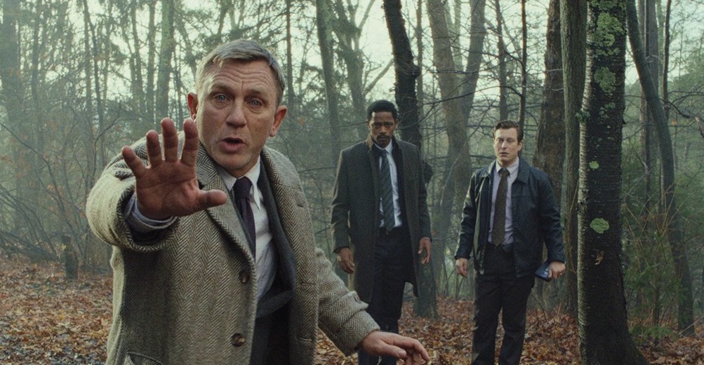

# FaceDetect 

FaceDetect is a simple cmd line tool to detect front faces in images and output found face locations as json. With front faces it is meant that both eyes are visible. 

## Go

To build it requires go. It has been tested with go 1.21. Perform **go mod tidy** to get dependencies. It uses the pigo face detect library.


## Usage
```
Usage of facedetect:
facedetect [flags] -in image.jpg

This tool tries to detect front faces in the image file specified with the -in flag.
Supported image formats are: jpeg.

Required flags:
  -in string
                Image file

Optional flags:
  -bbox string
                Bounding box to limit the search, in normalized coordinates. x,y,w,h (default "0,0,1,1")
  -debug
                Output a debug.jpg
  -fq float
                Min face quality to accept the face. (default 1)
  -fs float
                Min face size to accept the face. (default 40)
  -iou float
                The intersection over union threshold for cluster detection (default 0.15)
  -pretty
                Pretty-print the json output
  -version
                Display version
  -h, --help
                Display this help

```


## Example

Detect faces in a screenshot:


```sh
./facedetect.darwin.arm64 -in docs/image1.jpg -debug -fq 4.0 -fs 40 -pretty 
```
Detecting three faces in an image with specified min quality and size. The output json could look like:
```json
{
   "faces": [
      {
         "face": {
            "cx": 446,
            "cy": 146,
            "size": 93
         },
         "lefteye": {
            "cx": 434,
            "cy": 141,
            "size": 7
         },
         "righteye": {
            "cx": 457,
            "cy": 135,
            "size": 7
         },
         "quality": 9.952968
      },
      {
         "face": {
            "cx": 159,
            "cy": 105,
            "size": 93
         },
         "lefteye": {
            "cx": 142,
            "cy": 101,
            "size": 7
         },
         "righteye": {
            "cx": 174,
            "cy": 102,
            "size": 7
         },
         "quality": 191.7723
      },
      {
         "face": {
            "cx": 610,
            "cy": 151,
            "size": 61
         },
         "lefteye": {
            "cx": 601,
            "cy": 149,
            "size": 5
         },
         "righteye": {
            "cx": 624,
            "cy": 149,
            "size": 4
         },
         "quality": 19.041996
      }
   ]
}
```

The found faces (and eyes) are specified by a circle with center point (cx, cy) and diameter given by size. The value of quality specifies how good and the higher the better.

The generated debug.jpg image


